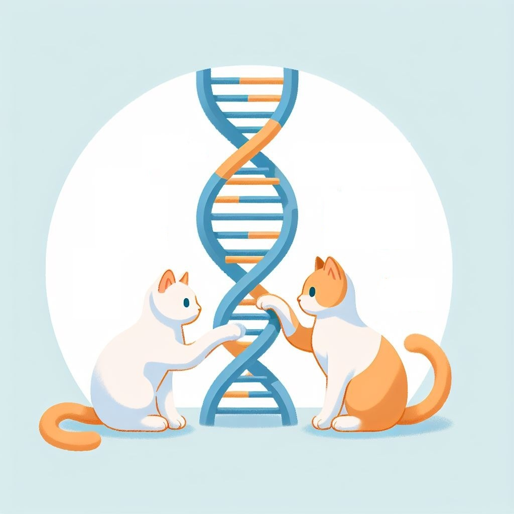
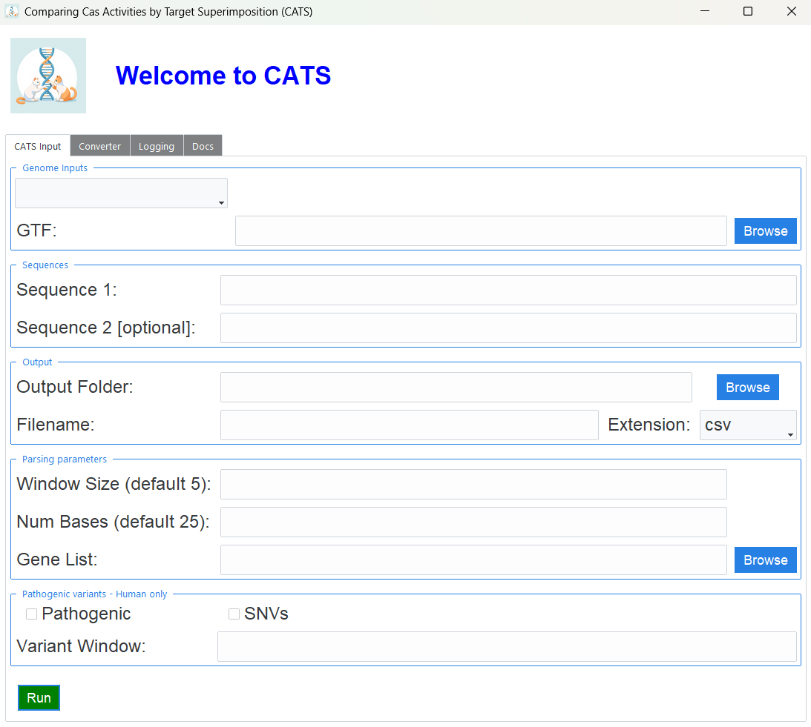

# **C**omparing Cas **A**ctivities by **T**arget **S**uperimposition (**CATS**)

<div align="center">
<p></p>
</div>

**CATS** is a bioinformatic tool designed to automate the detection of overlapping PAM sequences and identify allele-specific targets resulting from pathogenic mutations. It offers both a command-line interface (CLI) and a graphical user interface (GUI) to cater to different usage preferences.
For further details, see the associated publication: [*CATS: A Bioinformatic Tool for Automated Cas9 Nucleases activity comparison in clinically relevant contexts*](https://doi.org/10.3389/fgeed.2025.1571023).


## Table of Contents

1. [Installation](#installation)
   * [CLI installation](#cli-installation)
   * [GUI installation](#gui-installation)
2. [Usage](#usage)
   * [CLI usage](#cli-usage)
   * [GUI usage](#gui-usage)
3. [Contributing](#contributing)
4. [License](#license)
5. [Citation](#citation)


## Installation

### CLI installation

1. Clone the repository:

   ```bash
   git clone https://github.com/Physics4MedicineLab/CATS.git
   cd CATS
   ```

2. Install **CATS**:

   ```bash
   pip install -r requirements.txt
   pip install .
   ```

### GUI installation

Install the latest [release](https://github.com/Physics4MedicineLab/CATS/releases), ensuring that you download the version compatible with your operating system.

If the GUI fails to launch properly, you can try running it manually using the gui.py file located in the `gui` folder.
Make sure all dependencies are installed, then run the following command (from inside the `CATS` directory):

```bash
python gui/gui.py
```

**NOTE for macOS users**:

After downloading and unzipping the CATS folder, you may need to run the following command in your terminal to ensure the application runs correctly:

```bash
xattr -dr com.apple.quarantine <dir>/CATS/
```

or

```bash
find <dir>/CATS/ -exec xattr -d com.apple.quarantine {} \;
```

Replace `<dir>` with the full path to the directory containing the unzipped CATS folder.

Only run this command **once**, *after* you have downloaded and unzipped the folder and *before* launching the GUI.

## Usage

Once installed, you can either use the **CLI** or launch the **GUI**.

### CLI Usage

To launch the **CATS** CLI and show the help message with all the possible flags and parameters, run:

```bash
CATS --help
```

which will show this message:

```text
usage: CATS [-h] --fasta FASTA_FILE --seq1 SEQ1 [--seq2 SEQ2] --output OUTPUT [--window-size WINDOW_SIZE] [--num-bases NUM_BASES] [--gtf GTF_FILE] [--pathogenicity] [--single-nucleotide-variant] [--gene-list GENE_LIST]          [--variant-window VARIANT_WINDOW]

Parse a FASTA file and find sequences containing one (or two) specified sequences of interest.

options:
  -h, --help            show this help message and exit
  --fasta FASTA_FILE, -f FASTA_FILE
                        Path to the FASTA file or use 'human', 'mouse', 'human_pc' or 'mouse_pc' keyword to access corresponding transcripts.
  --seq1 SEQ1, -1 SEQ1  First sequence of interest.
  --seq2 SEQ2, -2 SEQ2  (Optional) Second sequence of interest. If omitted, only seq1 will be searched.
  --output OUTPUT, -o OUTPUT
                        Output file name. Possible extensions: 'csv', 'tsv', 'bed'.
  --window-size WINDOW_SIZE, -w WINDOW_SIZE
                        Size of the window around the sequences (for double-sequence mode). Default is 5.
  --num-bases NUM_BASES, -n NUM_BASES
                        Number of preceding and subsequent bases for each output sequence. Default is 25.
  --gtf GTF_FILE, -g GTF_FILE
                        Path to the GTF file for annotation.
  --pathogenicity, -p   Retrieve only sequences containing potentially pathogenic variants (ClinVar).
  --single-nucleotide-variant, -snv
                        Retrieve only sequences associated with SNVs from ClinVar. Implies --pathogenicity.
  --gene-list GENE_LIST, -gl GENE_LIST
                        Path to a txt file containing a list of gene names to be analyzed, OR a semicolon-separated list of gene names (e.g. 'HBB;HTT').
  --variant-window VARIANT_WINDOW, -vw VARIANT_WINDOW
                        Maximum distance between the mutation and the found PAM sequence. Implies --pathogenicity.
```

### CATS-converter

The **CATS-converter** command-line tool allows you to convert files between *bed* and *csv* formats, without needing to rerun the main **CATS** workflow.

```bash
CATS-converter <path/to/file.(csv|bed)>
```


### GUI Usage
After installing the GUI version, simply navigate to the GUI folder and run the executable. Once launched, the following window will appear:

<div align="center">
<p></p>
</div>

A detailed documentation can be found in the fourth and last tab (`Docs`).

For further reference, consult the publication: [*CATS: A Bioinformatic Tool for Automated Cas9 Nucleases activity comparison in clinically relevant contexts*](https://doi.org/10.3389/fgeed.2025.1571023).

## Contributing
Pull requests, bug reports, and feature ideas are welcome: feel free to open a PR!


## License
This project is licensed under the MIT License - see the [LICENSE](LICENSE) file for details.


## Citation

Please cite our work if you use **CATS** in your research:

```bibtex
@article{Rocchi2025CATS,
  author = {Rocchi, Ettore and Magnani, Federico and Castellani, Gastone and Carusillo, Antonio and Tarozzi, Martina},
  title = {{CATS}: A Bioinformatic Tool for Automated Cas9 Nucleases Activity Comparison in Clinically Relevant Contexts},
  journal = {Frontiers in Genome Editing},
  volume = {7},
  number = {Tools and Mechanisms},
  pages = {1571023},
  year = {2025},
  doi = {10.3389/fgeed.2025.1571023},
  url = {https://doi.org/10.3389/fgeed.2025.1571023}
}
```